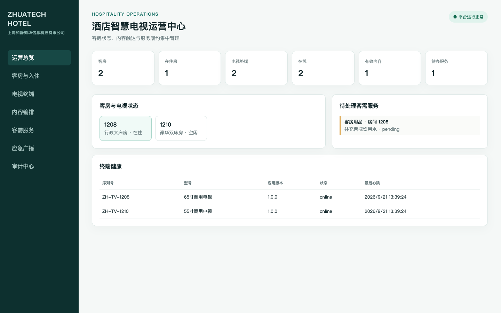
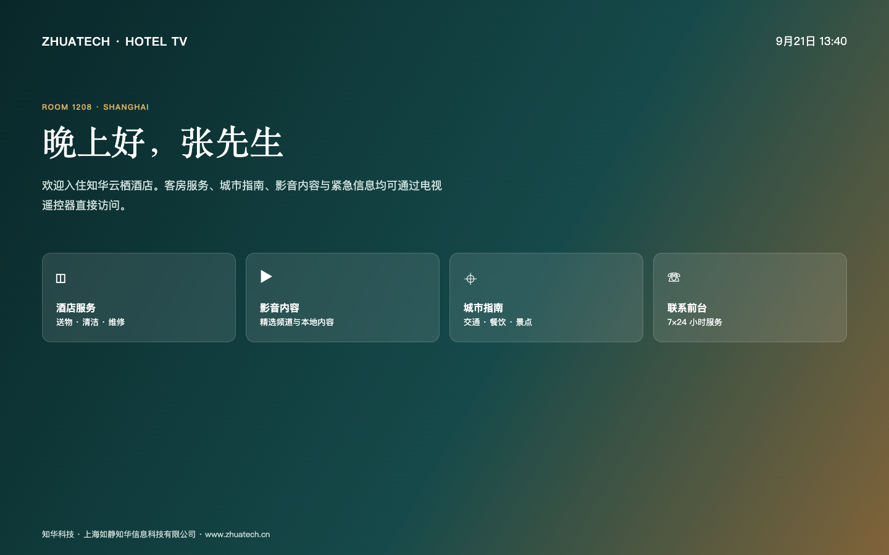

# 知华酒店智慧电视平台社区版

[简体中文](README.md) | [English](README.en.md)

`zhuatech-hotel-tv` 面向酒店、公寓与康养机构，提供电视终端配对、客房入住联动、欢迎页、内容编排、住客影音、客需工单、设备健康和紧急广播。它不是一张静态大屏：仓库内实现了可执行的入住/退房状态机、内容有效期、播放鉴权、服务 SLA 和广播触达逻辑。

项目由[知华科技（上海如静知华信息科技有限公司）](https://www.zhuatech.cn/)维护。酒店数字化、智慧电视、Android TV/国产终端适配、商业授权或深度定制，请微信添加 `zhuatech` 或 `zhuatech2`。

| 运营管理中心 | 客房电视端 |
| --- | --- |
|  |  |

## 住客旅程

```text
客房建档 → 电视安全配对 → PMS办理入住 → 电视欢迎会话
   → 内容播放 / 客需服务 → 工单履约 → 退房清除会话
```

## 已实现能力

| 业务域 | 核心能力 |
| --- | --- |
| 酒店与客房 | 多酒店、房号唯一、房型楼层、空闲/在住状态 |
| 电视终端 | 序列号配对、设备令牌、心跳、版本与存储监测 |
| 住客会话 | 入住/退房、姓名脱敏、语言偏好、空房播放隔离 |
| 内容中心 | 视频/图片/网页/公告、语言、受众、有效期校验 |
| 客需服务 | 电视发单、SLA 截止时间、接单/完成状态机 |
| 应急广播 | 严重级别、在线设备快照、指令审计 |
| 平台治理 | API Key、设备令牌入口、JSON 快照、MySQL 模型、审计事件 |

## 启动

```bash
cp .env.example .env
npm test
HOTEL_TV_API_KEY=zhuatech-demo-key npm start
```

- 运营端：`http://127.0.0.1:18201/`
- 客房电视端：`http://127.0.0.1:18201/tv`
- 健康检查：`http://127.0.0.1:18201/health`
- Docker：`docker compose up --build`

演示请求头是 `x-api-key: zhuatech-demo-key`。生产部署应接入 PMS/门锁/内容 CDN 与企业身份平台，轮换设备令牌，并启用 TLS、数据库加密、内容版权校验和个人信息分级保护。

## 工程结构

```text
src/domain.js        酒店电视领域规则与状态机
src/server.js        零依赖 HTTP API 与快照持久化
public/              运营管理中心与电视端
database/schema.sql  MySQL 8 生产模型参考
test/                Node.js 原生自动化测试
```

## 许可边界

仅允许个人学习、研究和交流，**不得商用**。企业内部使用、私有部署、SaaS、项目交付、收费服务或投标必须取得上海如静知华信息科技有限公司书面授权。本项目是 source-available 社区源码，不是 OSI 定义的开源许可证项目。

## 微信咨询

| 微信号 `zhuatech` | 微信号 `zhuatech2` |
| --- | --- |
|  |  |

Copyright © 上海如静知华信息科技有限公司。
